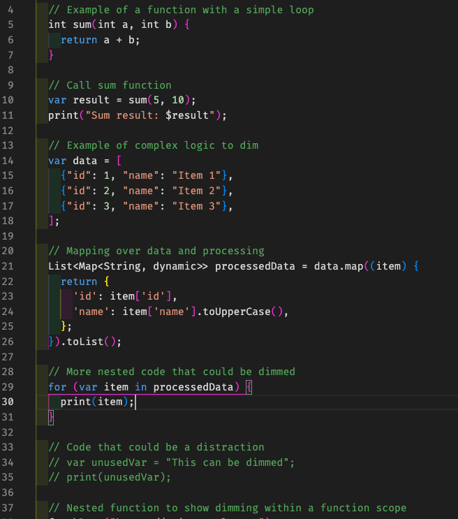
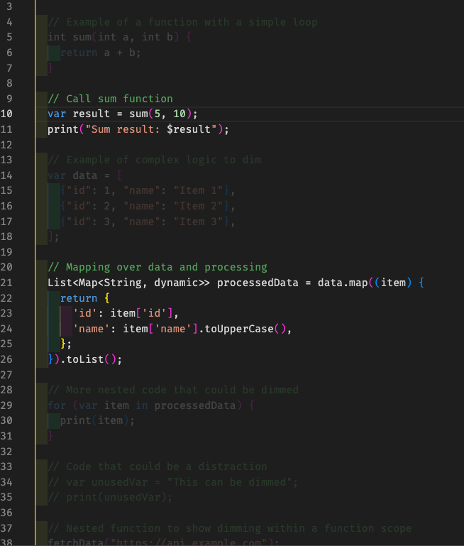

# Night Shift

Night Shift lets you **dim selected lines in your code editor** to reduce visual clutter.

Ideal for:

- Tracing data flow
- Simplifying complex files
- Focusing on the logic you care about

---

## Features

- **Isolate mode**: Dim everything _except_ the lines you select (`Cmd + Shift + 1`)
- **Toggle dim**: Dim or undim selected lines (`Cmd + Shift + 2`)
- **Clear dims in current file** (`Cmd + Shift + 9`)
- **Clear all dims across all files** (`Cmd + Shift + 0`)
- Subtle, non-destructive styling — your code stays clean

## Why?

Sometimes, the hardest part of reading code is ignoring what you don’t need.

Night Shift gives you a soft focus tool — think of it like a spotlight for your mind.

---

## Keybindings

| Command                                 | Shortcut        |
| --------------------------------------- | --------------- |
| Isolate Selection (dim everything else) | Cmd + Shift + 1 |
| Toggle Dim on Selection                 | Cmd + Shift + 2 |
| Clear Dims in Current File              | Cmd + Shift + 9 |
| Clear All Dims                          | Cmd + Shift + 0 |

---

## Getting Started

1. Select the lines of code you want to focus on
2. Press `Cmd + Shift + 1` to **isolate** them (dim everything else)
3. Use `Cmd + Shift + 2` to toggle dim on selected lines
4. Clear dims with `Cmd + Shift + 9` (file) or `Cmd + Shift + 0` (all files)

---

## Tip

You can also trigger commands from the Command Palette:

- `Night Shift: Isolate Selection`
- `Night Shift: Toggle Dim`
- `Night Shift: Clear Dims in File`
- `Night Shift: Clear All Dims`

---

Made with care 💛
If you have feedback or ideas for improvement, would love to hear from you!  
📬 pkhanthee@gmail.com
